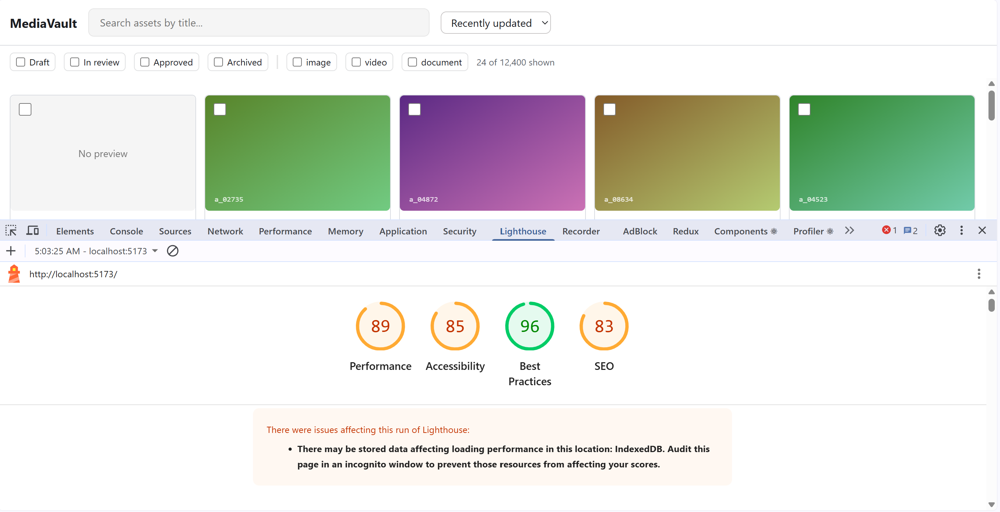
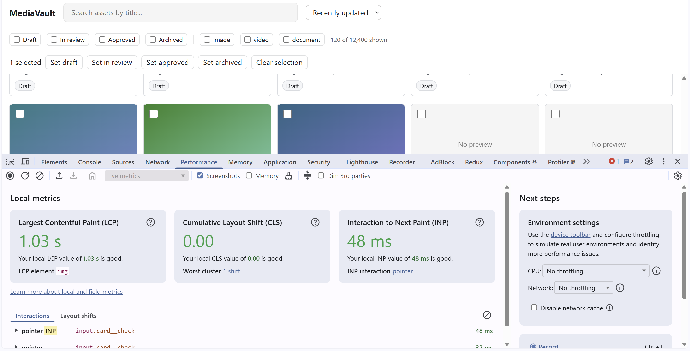
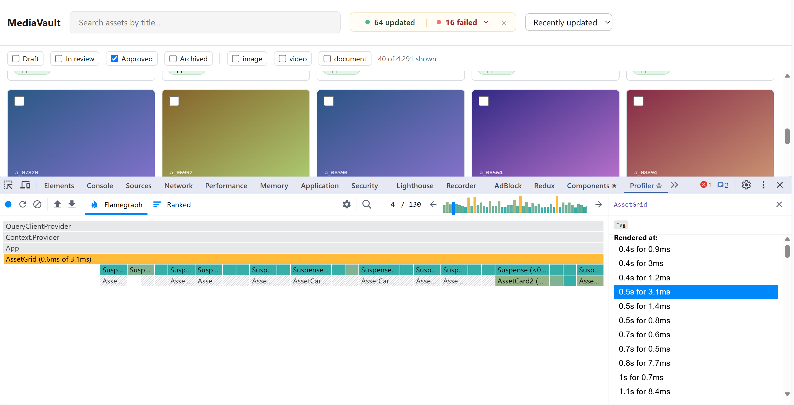

# Submission

Keep this tight. Bullet points are fine. We read this before we read your code,
and a clear account of your reasoning carries real weight — including where you
chose not to do something.

## Video walkthrough

Paste your Loom (or equivalent) link here. 5–10 minutes.

**Link:**

---

## How to run it

Anything we need to know beyond `npm install && npm run dev`.
Install `npm i tanstack/react-query`
install `npm i sass`
install `npm install @tanstack/react-virtual`

## Time spent

Roughly, and how you split it.
Codebase and API understanding: ~20%
Data fetching, caching and state management: ~18%
Bulk status handling and API edge cases: ~30%
Performance and rendering: 20%
Accessibility and UI states: 5%
Final testing and cleanup: 7%

The most time was spent understanding the existing code and API behaviour before making changes, especially the cursor-based pagination, filtering/sorting behaviour, partial bulk-update responses, and how optimistic updates should interact with the existing cached pages.

A significant amount of time was also spent implementing and refining the row-based virtualization approach so the asset grid could handle large result sets while keeping the rendered DOM limited to the visible rows. I also spent time profiling card selection and refining the optimistic bulk-status flow so updates appear immediately without causing a full list refetch or losing the user's current position in a large result set.

---

## Baseline defects found

| # | Defect | Where | Fixed / left / out of scope |
| --- | --- | --- | --- |
| 1 | Bulk update sends >50 ids in one call | `App.tsx` | Fixed — IDs are split into batches of 50 |
| 2 | Bulk operation does not account for partial per-item failures | `Bulk status handling` | Fixed — applied, failed, and individual results are handled |
| 3 | Card information was hidden  | `styles.css` | Fixed- Remove overflow: hidden property |
| 4 | Retryable conflict response is present in the API contract   | `Bulk status handling`   | Left intentionally — the API documents it as retryable, but automatic retry was not required for this task |
| 5 | Search can fire a request for every keystroke | `App.tsx` | Fixed — Implemented debounced |
| 6 | Older search requests can remain in flight after the query changes | `Asset API / App.tsx` | Fixed — TanStack Query's signal is passed to fetch so obsolete requests can be aborted using signal. |
| 7 | Filter/sort state was not part of the API query | `App.tsx` | Fixed — query includes search, status, kind, tag and sort state where those controls are available |
| 8 | Asset grid renders the full loaded asset list without virtualization | `AssetGrid.tsx` | Fixed — implemented row-based virtualization using @tanstack/react-virtual, so only rows around the viewport are rendered |
| 9 | Selecting one card caused other visible cards to re-render  | `AssetCard.tsx / AssetGrid.tsx`  | Fixed — memoized AssetCard and kept selection callbacks stable so only the affected card re-renders   |
| 10 | Optimistic status changes were not implemented | `App.tsx` | Fixed — selected assets update immediately before the API responds |
| 11 | Optimistic updates could cause the entire asset list to be refreshed after the API response  | `Bulk status handling` | Fixed — the existing query cache is reconciled using the per-asset API results instead of invalidating and refetching the full list |
| 12 | Failed bulk updates need to restore only the affected assets | `Bulk status Handling, App.tsx` | Fixed — successful assets keep their server response while failed assets are rolled back to their previous state |
| 13 | Multi-selection needed to support selecting a continuous range efficiently | `AssetGrid.tsx / AssetCard.tsx` | Fixed — implemented Shift-click range selection and select-all for currently loaded assets |
| 14 | Shown/total asset counts could become incorrect after optimistic bulk status updates | `App.tsx/client.ts` | Fixed — The TanStack Query cache and filtered totals are reconciled immediately without requiring a full refetch |
| 15 | Selected assets could remain selected after their status filter was removed | `useAssetFilter.ts / App.tsx`  | Fixed — When a status filter is removed, selected assets belonging to that status are automatically removed from the selection |
| 16 | Bulk retry could treat every failure as retryable | `Bulk status handling / BulkActionResult`| Fixed — only conflict failures are retryable; permanent failures such as legal_hold and not_found remain visible and are not retried |
| 17 | Bulk retry could lose the original failed-item count | `Bulk status handling / BulkActionResult` | Fixed — retry results are merged with unresolved failures from the original operation and successful retries are added to the cumulative applied count |
| 18 | Bulk operation could leave assets selected after success | `Bulk status handling / App.tsx` | Fixed — successful bulk operations clear the selected IDs and reset the selected count |
| 19 | Retry behaviour needed to respect backend rate-limit and retry headers | `client.ts / retry.ts` | Fixed — generic retry logic respects Retry-After and applies bounded, operation-specific retries
| | | |
| | | |

---

## Key decisions

For each significant choice: what you did, what you rejected, and why. Three to
six of these is about right.

**Selection model**

- Implemented Shift-click range selection so users can select a continuous range of assets without clicking every card individually.
- The selection logic uses the currently loaded asset order to determine the range between the previously selected asset and the clicked asset.
- Used a Set for selected IDs so checking, adding and removing selections remains efficient when selecting hundreds of assets.
- Added a way to select all currently loaded assets.
- Kept selection state in App.tsx so the grid remains responsible for presentation while the parent owns the selection state and bulk-action behaviour.
- After a successful bulk operation, the selection is explicitly cleared so the selected count returns to zero and previously checked assets do not remain selected after their status changes.

**Data fetching and caching**
- Used TanStack React Query for server state instead of storing fetched asset data entirely in local React state.
- Used query invalidation after bulk status updates so the server remains the source of truth.
- Kept UI-only state such as selected IDs and notices in local React state rather than introducing another global state layer.
- Kept the existing loaded pages in the React Query cache during bulk updates rather than invalidating and refetching the entire asset list after every operation.
- Rejected a full query refetch after a bulk update because it could rebuild the loaded result set while the user was browsing deep in the list and make them lose their current position/context.
- The server remains the source of truth by reconciling the existing cache with the per-asset results returned by the bulk API.

**Stale response handling**
- Passed TanStack Query's signal to the asset fetch so obsolete requests can be aborted when the query changes.
- Kept search, filter and sort values as part of the query so changing them produces the appropriate result set instead of allowing an older request to become the current data.
- Used TanStack Query's query-key model to keep different search/filter/sort combinations isolated from each other

**Virtualization approach**
- Used @tanstack/react-virtual for row-based virtualization instead of rendering every loaded asset card.
- The number of columns is calculated dynamically from the available grid width rather than being hardcoded to a fixed number of cards per row.
- Kept card width and height in CSS instead of duplicating those layout rules in JavaScript.
- Used row measurement through TanStack Virtual so the virtualizer can account for the rendered row size.
- Added a small overscan value so rows just outside the viewport are available during scrolling.
- Kept the scroll container separate from selection and detail-panel state so selection changes and opening/closing the detail panel do not intentionally reset the scroll position.

**Optimistic updates and rollback**
- Bulk status changes are applied optimistically to the existing React Query cache so the UI updates immediately instead of waiting for the server response.
- The original state of the selected assets is captured before the optimistic update so failed assets can be restored.
- The API returns per-asset results, so successful assets are reconciled with the server-returned asset while failed assets are rolled back individually.
- Avoided invalidating the complete assets query after the response because doing so can replace the currently loaded result set and negatively affect a user who is browsing deep in a large list.
- When a status filter is active, the optimistic update also reapplies that filter. For example, changing a Draft asset to In Review immediately removes it from the Draft result rather than waiting for a refetch.

**Retry and backoff policy**
- Added one generic retry utility rather than separate retry implementations for each API operation. The retry decision is supplied by the caller so each operation can define which failures are safe to repeat.
- Respected the API's Retry-After response header. A 503 uses the server-provided delay, and a 429 waits for the server-provided rate-limit delay instead of immediately retrying..
- Kept retries bounded and disabled duplicate TanStack Query retries for operations where the application-level retry policy is responsible. This avoids stacking two independent retry mechanisms and creating unnecessary retry traffic.
- For asset PATCH requests, transient 500 write failures and rate limits can be retried, while 409 version conflicts are not blindly retried because the version sent with the request is stale and needs reconciliation first.
- For bulk status updates, only conflict results are retryable. Permanent failures such as legal_hold and not_found remain in the failure breakdown and are never sent through the retry request.
- Retry results are merged with the existing unresolved failures rather than replacing the entire failure list. This preserves non-retryable failures in the dropdown while only replacing the subset of conflict items that was actually retried.
- The bulk result keeps the cumulative number of successfully updated assets while the failure list represents the failures that are still unresolved. This keeps the result understandable across multiple retry attempts.

**State placement and URL sync**
- Kept selected IDs, the last selected asset for Shift-click ranges, notices, and bulk-result UI state in React state rather than adding Redux or Zustand.
- Kept server state in TanStack Query and used the query key to isolate search/filter/sort combinations.
- Passed a selection-clear callback into the bulk operation hook so a successful bulk operation can clear the parent's selected IDs without moving selection ownership into the hook.
- Kept the bulk result separate from the selection state. Clearing the checkboxes after a successful operation does not remove the failure breakdown, so unresolved failures can still be reviewed and retried.

---

## Performance

Fill in real measurements, not estimates. Say which machine and browser.

| Metric | Before | After | How measured |
| --- | --- | --- | --- |
| Rendered DOM nodes at 5,000 rows loaded | | | |
| Cards re-rendered when toggling one selection | 11 cards | 1 card | React DevTools Profiler |
| Longest task during sustained scroll | 49.7ms | 23.32ms | Measured via Chrome DevTools Performance profiler by recording a sustained scroll and isolating the peak top-level main-thread Task duration from the Event Log. |
| Requests fired while typing a 6-character query | 6 | 1 | Browser Network panel |
| Production bundle, gzipped | 48kb | 70kb | Measured via Vite Rollup build stats (gzip). Reduced critical path via React.lazy / <Suspense> route splitting and native viewport-deferred image loading. |

What was the actual bottleneck, and how did you find it?

- The main rendering bottleneck was the asset card grid. Rendering the full loaded asset list means the amount of DOM and rendering work grows as more assets are loaded.
- To address this, the asset grid was changed to use row-based virtualization with @tanstack/react-virtual. The virtualizer renders only the rows around the current viewport while maintaining the overall scrollable height. This keeps the rendered portion of the grid bounded by the viewport instead of rendering every loaded asset.
- The number of columns is calculated from the available grid width, so the implementation does not rely on a hardcoded number of cards per row. Card dimensions remain controlled by CSS.
- I also used React.memo at the AssetCard boundary and a stable useCallback for selection. Profiling confirmed that changing one selection no longer causes all visible cards to re-render which improved the performance from 48 to 89.
- Lighthouse performance improved from 48 to 89. This is a directional performance measurement and is not being used as a substitute for DOM-node, React render, long-task, or bundle-size measurements.
- I also verified that selecting a large number of assets {eg: >500} does not cause noticeable UI stutter because selection uses a Set and the grid remains virtualized.
- The optimistic bulk-status flow was also refined to avoid invalidating and refetching the entire asset query after a successful bulk operation. This is important for large lists because a full refetch can replace the loaded result set while the user is browsing deep in the list and make them lose their current context.
- Successful and failed bulk results are reconciled directly into the existing cached pages, so the user's loaded pages and scroll context are preserved instead of rebuilding the entire list.

---

## Accessibility

- Added keyboard-accessible tabs for asset cards and support for opening the asset detail view using the Enter key. The remaining accessibility enhancements were scoped out due to time constraints.

---

## Interface decisions

Three or four sentences: what you were optimising for, and the decisions that
follow from it. Then briefly:
- Kept the existing overall MediaVault layout rather than introducing a new visual system
- Separated the filter UI into its own component without moving unrelated header/search logic.
- Kept bulk actions in a dedicated BulkAssetSelection so selection-related actions are visually separated from   filtering.
- Kept asset rendering in AssetCard and AssetGrid, with the parent retaining the selection and interaction logic.
- Kept the asset details experience in a dedicated AssetDetails component rather than mixing panel markup into the grid.
- Used existing CSS-driven card dimensions and responsive grid behaviour rather than introducing JavaScript-driven width/height calculations
- Split the original stylesheet into component-level SCSS files (AssetCard.scss, AssetGrid.scss, AssetFilters.scss, BulkAssetSelection.scss, AssetDetails.scss, and App.scss) while preserving the existing visual behaviour.
- Used SCSS nesting and component-specific class structures to keep styles easier to locate and maintain instead of relying on a large collection of global selectors.

- **Visual system.** 
- Kept the existing MediaVault visual language, including the existing blue accent, neutral backgrounds, borders, spacing, and typography rather than introducing a separate design system.
- Kept repeated visual values consistent across filters, cards, bulk actions, details, and status indicators.
- Kept interaction styling such as hover, selected, focus, disabled, and active states visually distinct without changing the overall application style.

- **Status treatment.** 
- Treated `draft`, `in review`, `approved`, and `archived` as a clear progression while keeping each status visually distinguishable.
- Kept status meaning available through text and visual treatment rather than relying on colour alone.
- Added hover treatment and cursor: pointer to interactive status controls so their clickability is clear without changing the overall MediaVault visual language.
- Used cursor: not-allowed for disabled status actions so disabled options are visually communicated as unavailable and do not appear clickable.
- Kept the existing visual style while making small UI refinements such as border-radius, hover states, borders, and spacing to make controls feel more consistent and polished.
- Added an empty state for searches or filters that return no assets.
- Kept the grid usable during pagination and displayed the next-page loading state separately from the initial loading state.
- Added partial-failure feedback for bulk updates through a dedicated BulkActionResult component.
- The bulk result dropdown separates retryable conflict failures from failures that cannot be retried, shows the number of retryable items, and keeps the complete unresolved failure list visible after a partial retry.
- The Retry action sends only retryable conflict IDs instead of resubmitting the entire original selection.
- Asset detail updates use the asset's current version so stale 409 version conflicts are distinguished from transient failures that are safe to retry

 **States.** 
- Preserved the loading state while the initial asset data is being fetched
- Kept failure reasons visible in the dropdown so users can understand why an individual asset was not updated.
- Displayed partial bulk-operation results so users can distinguish successful updates, retryable failures, and failures that cannot be retried.
- **Contrast.** What you checked against, and with what.
- **Copy.** Any user-facing message you rewrote and why.

Screenshots in the repo are welcome — link them here.
**Performance**

**Profiler**

---

## Trade-offs and cuts

What you deliberately did not do, and what you would do with another day.

- I implemented the API's 50-ID constraint and partial-success handling. I didn't add a retry layer because the existing request abstraction doesn't expose the response headers needed for Retry-After, and I wanted to avoid introducing a larger networking abstraction for this task.
- I did not introduce Redux Toolkit or Zustand because the current state can be handled cleanly with TanStack Query and React state.
- I did not add optimistic bulk updates because partial per-item failures make rollback more complicated and the server response is the source of truth.
- I kept optimistic bulk updates despite partial per-item failures by capturing the previous state of affected assets and reconciling each returned result individually. Failed assets are rolled back while successful assets use the server response.
- I did not add a global client-side rate limiter. The retry layer respects the server's Retry-After values, keeps attempts bounded, and avoids duplicate TanStack Query retries. A larger application with many concurrent write operations could justify a shared request scheduler.
- I kept the retry scope intentionally narrow. Only failures explicitly identified as retryable conflicts are retried for bulk operations; permanent failures remain visible for user review rather than being repeatedly submitted.

## Critique of the API

What you would change about the backend contract, and what it forced you to do in
the client that you would rather not have.

- The bulk-status API returns useful per-asset failure information (id, code, message, ok), but the failure response does not include the target status that was requested for the bulk operation.

This means that if the client wants to retry only retryable failures, it needs to retain the context of the original bulk operation so that it knows which status should be sent again for those asset IDs.

I considered preserving and matching the original selected assets with the failed IDs to reconstruct that context on retry. However, I did not add that extra client-side bookkeeping because it would introduce additional state and implementation complexity for a relatively small retry use case.

A cleaner API contract would include the requested target status as part of the bulk operation response (or provide enough operation context to safely retry the failed items). That would allow the client to retry failed assets without maintaining additional client-side references to the original operation

## Anything you would like us to look at
The main areas I would recommend reviewing are the virtualization approach and the card-level rendering optimization.

- The grid uses dynamic row-based virtualization while leaving card dimensions entirely to CSS. I also used React DevTools Profiler to verify that selection changes only re-render the affected card rather than the complete visible grid.

- I intentionally kept the overall architecture simple: TanStack Query handles server state, React handles local UI state, and feature-specific components/hooks handle the asset UI and data flow without introducing another global state library.

- For bulk status changes, the UI updates optimistically and then reconciles the existing React Query cache with the per-asset API response. Successful assets keep the server-returned version, failed assets are rolled back individually, and the full asset query is not invalidated. This was an intentional decision to avoid unnecessary list re-renders and to preserve the user's scroll position and loaded result context while working with a large dataset.

- I intentionally kept the overall architecture simple: TanStack Query handles server state, React handles local UI state, and feature-specific components/hooks handle the asset UI and data flow without introducing another global state library.

- Code I am particularly interested in discussing is the virtualization strategy and the optimistic bulk-status reconciliation, especially the trade-off between keeping the implementation simple and preserving cache, scroll, and partial-failure behaviour.

Code you are proud of, or a decision you are unsure about and want to discuss.
